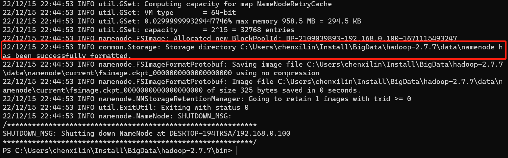

## Win11安装Hadoop2.7.7

1、下载 [Apache Hadoop](https://hadoop.apache.org/release/2.7.7.html)

2、解压至 `C:\Users\chenxilin\Install\BigData\hadoop-2.7.7`

3、配置环境变量：HADOOP_HOME、PATH

4、hadoop-env.cmd

```bash
set JAVA_HOME=C:\Users\chenxilin\Install\Language\Java\8u351
```

5、hdfs-site.xml

```
<configuration>
 <property>
        <name>dfs.replication</name>
        <value>1</value>
    </property>
    <property>
        <name>dfs.namenode.name.dir</name>
        <value>/C:/Users/chenxilin/Install/BigData/hadoop-2.7.7/data/namenode</value>
    </property>
    <property>
        <name>dfs.datanode.data.dir</name>
        <value>/C:/Users/chenxilin/Install/BigData/hadoop-2.7.7/data/datanode</value>
    </property>
</configuration>
```

6、创建三个文件夹

- `C:\Users\chenxilin\Install\BigData\hadoop-2.7.7\tmp`
- `C:\Users\chenxilin\Install\BigData\hadoop-2.7.7\data\datanode`
- `C:\Users\chenxilin\Install\BigData\hadoop-2.7.7\data\namenode`

7、格式化

以**管理员身份**打开命令提示符，输入`hdfs namenode -format`,看到如下所示就说明format成功



8、下载https://github.com/kontext-tech/winutils 复制替换对应版本的bin目录

9、启动hadoop

```
cd C:\Users\chenxilin\Install\BigData\hadoop-2.7.7\sbin
star
```


